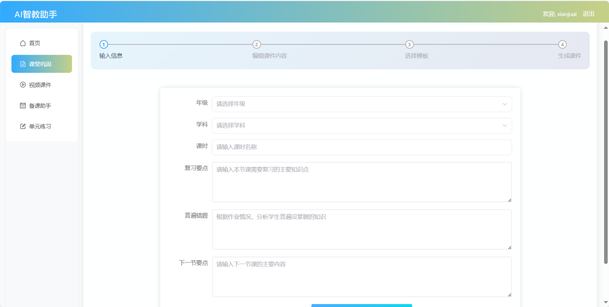

# AI教学助手（frontend）

**项目简介**:
- **用途**: AI智教助手系统的前端界面
- **技术栈**: Vue + Vite（参考 `package.json`）。

**核心功能**

视频介绍：
https://www.bilibili.com/video/BV1QP2qBMEsn/

---

## 1. 课堂巩固

高效总结复习知识点、分析错题和新课预习提示，快速生成课堂要点的巩固课件。课件采用固定模式，对应教学过程中的复习、预习和订正，通过行为培养，让学生自然形成学习思维和习惯。


老师只需输入课堂的学习要点方向，系统自动总结为 3 个要点；或根据作业提交的错误类型自动汇总并输出参考解题思路。



---

## 2. 视频课件

将巩固课件转化为视频以增强学生接受度，支持男声、女声和童声几种语音，同步切换，自动获取旁白，使学生可以反复观看、加深印象。


---

## 3. 备课助手

智能生成融合 STEAM 理念的跨学科教案和备课素材，提供高频考题、跨学科融合示例等，使教学目的更加明确，为教学提供多角度、多方位参考。

- 示例：根据单元主题生成教学目标、课堂流程（导入—讲解—活动—反馈）和所需材料清单。

示例输出（节选）:
```text
教学目标：理解分数基本概念并掌握同分母加减法。
课堂活动：1) 实物分割演示（数学+艺术）；2) 小组竞赛题 5 道（计时）；3) 家庭作业（应用题 3 道）。
```


---

## 4. 单元练习

生成符合教学大纲的习题与测验，帮助学生巩固所学知识。可根据不同学生的知识掌握情况，进行单（多）项强化练习，专攻薄弱环节，做到“千人千题”。


---

## 5. 仿真教学（PhET 集成）

整合 PhET 仿真教学功能，涵盖数学、物理、化学和生物等内容。通过仿真演示与交互式活动，让学生更容易理解抽象概念，并将知识与生活场景结合。

- 示例用法：课堂中嵌入 PhET 仿真模块，学生通过拖拽、改变参数观察实验结果，并在系统中记录实验数据与结论。


---

**准备工作**:
- **Node**: 建议使用 Node.js 16+。
- **包管理**: 仓库包含 `pnpm-lock.yaml`，优先使用 `pnpm`，也可使用 `npm` 或 `yarn`。

**本地开发**:
- 安装依赖（pnpm）:
```powershell
pnpm install
```
- 启动开发服务器:
```powershell
pnpm run dev
```
- 若使用 npm:
```powershell
npm install
npm run dev
```

**构建**:
```powershell
pnpm run build
# 或者
npm run build
```

构建产物通常会输出到 `dist`（或由 `vite.config.js` 指定的位置），用于部署到静态主机或与后端一同托管。

**环境变量**:
- 请参考 `frontend/.env` 文件，按需填写 API 地址或密钥。例如：
  - `VITE_API_BASE_URL`：后端 API 的基础地址。

**常见文件**:
- `index.html`：应用入口
- `src/`：前端源码（组件、路由、状态管理等）
- `public/`：静态资源

**调试与日志**:
- 在浏览器开发者工具中查看前端日志与网络请求。

**贡献**:
- 提交前请确保本地构建通过，遵循仓库的分支/提交规范。

**联系方式**:
- wx:su328732

